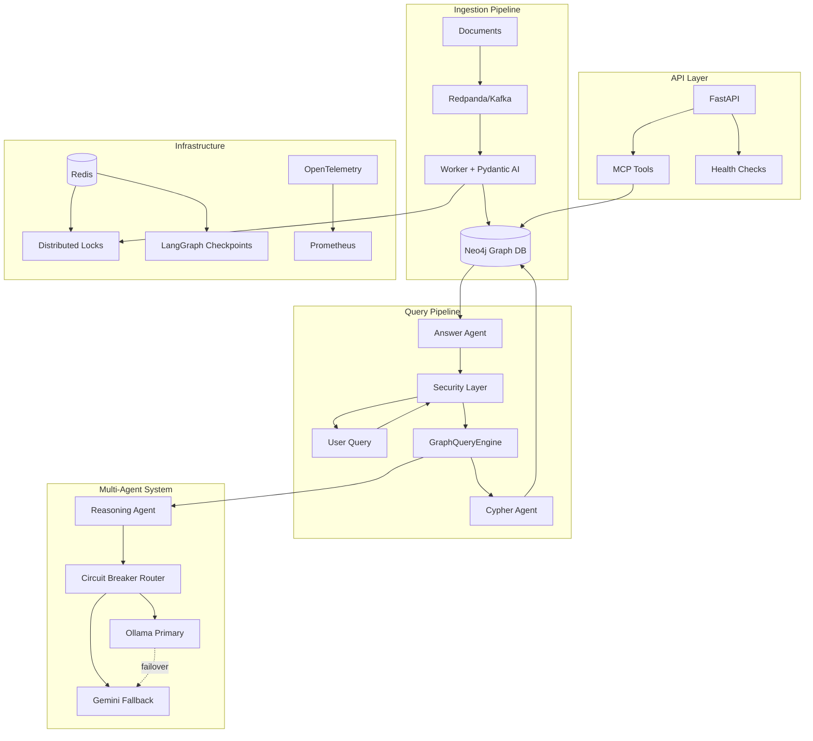
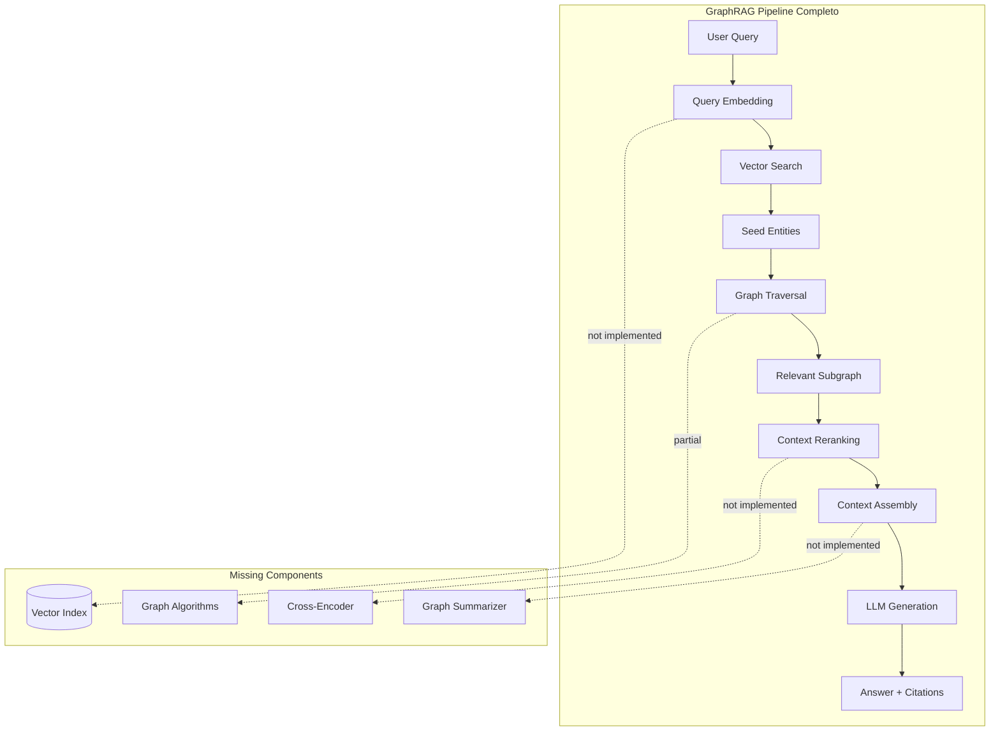

# CURRENT STATE - Nexus Graph AI (70% Completado)

**Fecha de Análisis:** 2026-04-04  
**Analista:** Lead AI Architect  
**Stack Base:** Python 3.12, Pydantic v2.10+, Neo4j 6.1.0, LangGraph

---

## A) ARQUITECTURA ACTUAL

### 1. Visión General del Sistema

Nexus Graph AI es un sistema de orquestación de grafos de conocimiento empresarial que integra:

- **Knowledge Graph (Neo4j):** Base de datos orientada a grafos con esquema ontológico definido
- **Multi-Agent System (LangGraph):** Orquestación de agentes con circuit breakers y failover
- **Security Layer:** PII sanitization (Presidio) + SLM Guards para prompt injection
- **Distributed Concurrency:** Redlock + Fencing Tokens sobre Redis
- **MCP Integration:** Model Context Protocol para exposición de herramientas a LLMs externos
- **Observability:** OpenTelemetry con métricas de LLM (TTFT, tokens, latencia)

### 2. Componentes Principales

#### 2.1 Core Engine ([`core/engine.py`](core/engine.py:1))

**Responsabilidad:** Motor de consultas en lenguaje natural → Cypher → Respuesta

**Flujo Actual:**
```
User Question → Security Sanitization → Cypher Generation (Pydantic AI) 
→ Neo4j Execution (READ-ONLY) → Answer Synthesis → Security Validation → Response
```

**Características:**
- Agente Cypher con prompt engineering extenso (11 reglas anti-alucinación)
- Uso de `pydantic-ai` con modelo `openai:qwen2.5:32b` (local Ollama)
- Validación de entrada/salida con [`SecurityEnforcer`](core/security_guardrails.py:159)
- Schema-aware: consulta dinámica del esquema Neo4j antes de generar Cypher
- **LIMITACIÓN:** Solo queries de lectura (MATCH/RETURN), no hay escritura desde el engine

#### 2.2 Database Layer ([`core/database.py`](core/database.py:1))

**Clase Principal:** [`Neo4jRepository`](core/database.py:40) (alias `Neo4jClient`)

**Características:**
- Driver asíncrono de Neo4j con retry logic (tenacity)
- Validación de identificadores Cypher con regex whitelist `[a-zA-Z0-9_]+`
- Batch UNWIND para ingesta optimizada
- Fencing tokens para concurrencia distribuida
- Transacciones ACID con verificación de tokens obsoletos

**Métodos Clave:**
- `add_graph_data()`: Ingesta de nodos y relaciones con fencing tokens
- `get_schema_snapshot()`: Introspección del esquema (labels, relationships, properties)
- `validate_cypher_identifier()`: Prevención de inyección Cypher

#### 2.3 Multi-Agent System ([`core/multi_agent.py`](core/multi_agent.py:1))

**Arquitectura:** LangGraph con StateGraph + AsyncRedisSaver

**Componentes:**
- **Circuit Breaker:** [`LLMREBreaker`](core/multi_agent.py:28) con threshold=3, timeout=60s
- **Providers:** 
  - Primary: [`OllamaProvider`](core/multi_agent.py:105) (Llama3 local)
  - Fallback: [`GeminiProvider`](core/multi_agent.py:128) (Gemini Pro cloud)
- **Router:** [`CircuitBreakerRouter`](core/multi_agent.py:158) con sanitización obligatoria antes de cloud egress
- **State Management:** [`AgentState`](core/multi_agent.py:233) con context tampering detection (SHA-256 signatures)

**Flujo:**
```
reasoning_agent → route_reasoning (conditional) → terminal_node
                ↓ (max 10 iterations)
                ↓ (circuit breaker triggers)
                → Gemini Fallback (con PII sanitization)
```

#### 2.4 Security Layer ([`core/security_guardrails.py`](core/security_guardrails.py:1))

**Componentes:**

1. **PIISanitizer** (Microsoft Presidio):
   - Detecta: PHONE, EMAIL, CREDIT_CARD, SSN, BANK_ACCOUNT, IBAN, IP_ADDRESS
   - Redacción automática con anonymizer
   - Fail-safe: retorna `[REDACTED_DUE_TO_SANITIZATION_FAILURE]` en caso de error

2. **SLMGuard** (Binary Classifier):
   - Endpoint: configurable via `SLM_GUARD_ENDPOINT`
   - Timeout: 1.0s (connect: 0.5s)
   - Modos: input/output validation
   - **FAIL-CLOSED:** retorna `False` en cualquier fallo de infraestructura

3. **SecurityEnforcer** (Facade):
   - `sanitize_input()`: PII + Prompt Injection check
   - `validate_llm_output()`: Toxicity + Leakage check

#### 2.5 Concurrency Management ([`core/concurrency.py`](core/concurrency.py:1))

**Clase:** [`OntologyLockManager`](core/concurrency.py:12)

**Características:**
- Redlock sobre Redis con locks distribuidos
- Fencing tokens monotónicos globales (`global_fencing_token`)
- Deadlock prevention: ordenamiento lexicográfico en `acquire_edge_locks()`
- Timeouts: lock=10s, blocking=5s

**Métodos:**
- `acquire_node_lock(node_id)`: Lock individual + fencing token
- `acquire_edge_locks(source_id, target_id)`: Lock dual con prevención de deadlock

#### 2.6 Ontology & Schema ([`core/ontology.py`](core/ontology.py:1))

**Registry Pattern:** [`OntologyRegistry`](core/ontology.py:35)

**Entidades Registradas:**
- `EMPRESA` (aliases: PROVEEDOR, CLIENTE, SOCIEDAD)
- `PEDIDO` (aliases: ORDEN, ENCARGO, PRODUCTO)
- `RIESGO` (aliases: PROBLEMA, ALERTA, RETRASO)
- `EMPLEADO` (aliases: PERSONA, COMERCIAL, RESPONSABLE)

**Relaciones Registradas:**
- `REALIZA_PEDIDO`, `ATIENDE_PEDIDO`, `TIENE_RIESGO`, `ASIGNADO_A`

**Validación:** [`ValidationPipeline`](core/ontology.py:194) con constraints de source/target

#### 2.7 Worker & Ingestion ([`core/worker.py`](core/worker.py:1))

**Arquitectura:** Kafka Consumer (Confluent) + Pydantic AI

**Flujo:**
```
Redpanda Topic (document_chunks) → Consumer → AI Extraction (GPT-4o) 
→ Validation Loop (max 3 retries) → Neo4j Ingestion (con fencing tokens)
```

**Características:**
- Manual offset commit para durabilidad
- Auto-recovery loop para errores de validación Pydantic
- Telemetry con OpenInference (OpenAI + DSPy instrumentors)

#### 2.8 API Layer ([`api/main.py`](api/main.py:1))

**Framework:** FastAPI con lifespan management

**Middleware Stack:**
1. Correlation ID injection
2. Active AI tasks tracking (KEDA scaling)
3. LLM latency tracking
4. Rate limiting per tenant (Redis-backed, 100 req/min)

**Endpoints:**
- `/health`: Deep health check (Redis + Neo4j + SLM Guard, timeout 3.0s)
- `/metrics`: Prometheus metrics
- `/mcp/*`: Model Context Protocol integration

**Security:**
- Global dependency: [`verify_cryptographic_identity`](core/auth.py) (JWT con X.509 CN/OU)
- Rate limiting por `token.sub`
- Exception handler centralizado para [`NexusError`](core/exceptions.py)

#### 2.9 MCP Integration ([`api/mcp.py`](api/mcp.py:1))

**Tools Expuestos:**
1. `read_graph_node`: Lectura de nodo por ID
2. `write_graph_edge`: Escritura de relación (requiere role=admin)
3. `query_subgraph`: Ejecución de queries pre-aprobadas

**RBAC:** Zero-Trust con verificación de role en contextvars

---

## B) VULNERABILIDADES Y MALAS PRÁCTICAS (Estándares B2B 2026)

### 🔴 CRÍTICAS

#### 1. **Tipado Pydantic Incompleto en Configuración**

**Archivo:** [`core/config.py`](core/config.py:84)

**Problema:**
```python
NEO4J_PASSWORD: SecretStr = secrets.get_secret_str("NEO4J_PASSWORD", "password")
```

- El default `"password"` es un hardcoded secret en producción
- Falta validación estricta de que las credenciales NO sean defaults

**Impacto:** Riesgo de despliegue con credenciales por defecto

**Solución B2B 2026:**
```python
@field_validator("NEO4J_PASSWORD")
@classmethod
def validate_password_not_default(cls, v: SecretStr) -> SecretStr:
    if v.get_secret_value() == "password":
        raise ValueError("Production deployment with default password is forbidden")
    return v
```

#### 2. **Falta de Validación de Versión de Pydantic**

**Archivo:** [`pyproject.toml`](pyproject.toml:1)

**Problema:**
```toml
requires-python = ">=3.10"
dependencies = ["pydantic-settings>=2.0.0"]
```

- Requiere Python 3.10+ pero el stack es Python 3.12
- Pydantic está en v2.12.5 (requirements.txt) pero pyproject.toml solo especifica `>=2.0.0`
- **INCONSISTENCIA:** No hay pin de `pydantic>=2.10` en pyproject.toml

**Solución B2B 2026:**
```toml
requires-python = ">=3.12"
dependencies = [
    "pydantic>=2.10.0,<3.0.0",
    "pydantic-settings>=2.13.0,<3.0.0",
]
```

#### 3. **Ausencia de Strict Mode en Pydantic Models**

**Archivos:** [`core/schemas.py`](core/schemas.py:1), [`core/ontology.py`](core/ontology.py:14)

**Problema:**
```python
class Node(BaseModel):
    id: str
    label: AllowedNodeLabels
    properties: Dict[str, Any]  # ❌ Any permite cualquier tipo
```

**Impacto:** Permite coerción implícita de tipos, violando principio de fail-fast

**Solución B2B 2026:**
```python
class Node(BaseModel):
    model_config = ConfigDict(strict=True, extra="forbid")
    
    id: str = Field(..., min_length=1, pattern=r"^[a-z0-9_]+$")
    label: AllowedNodeLabels
    properties: Dict[str, Union[str, int, float, bool, None]]  # Tipos explícitos
```

#### 4. **SLM Guard con Fail-Closed Demasiado Agresivo**

**Archivo:** [`core/security_guardrails.py`](core/security_guardrails.py:63)

**Problema:**
```python
except Exception as e:
    logger.error(f"SLM Guard Infrastructure failure: {e}", exc_info=True)
    return False  # ❌ FAIL-CLOSED bloquea TODO en caso de fallo
```

**Impacto:** Un fallo de red/timeout del SLM Guard bloquea TODAS las operaciones

**Solución B2B 2026:**
- Implementar circuit breaker para el SLM Guard
- Degradación gradual: después de N fallos consecutivos, pasar a modo "warn-only"
- Métricas de disponibilidad del SLM Guard en Prometheus

#### 5. **Falta de Idempotency Keys en Ingestion**

**Archivo:** [`core/worker.py`](core/worker.py:42)

**Problema:**
```python
async def insert_to_neo4j(graph_data: GraphExtraction) -> None:
    async with lock_manager.acquire_node_lock("global_ingest") as fencing_token:
        await neo4j_repo.add_graph_data(graph_data, fencing_token)
```

- Usa `check_idempotency_key()` en [`multi_agent.py`](core/multi_agent.py:77) pero NO en el worker
- Si Kafka redelivery ocurre, puede haber duplicados

**Solución B2B 2026:**
```python
async def insert_to_neo4j(graph_data: GraphExtraction) -> None:
    # Hash del contenido para idempotency
    content_hash = hashlib.sha256(
        json.dumps(graph_data.model_dump(), sort_keys=True).encode()
    ).hexdigest()
    
    if await check_idempotency_key({"content_hash": content_hash}):
        logger.info(f"Duplicate detected, skipping: {content_hash}")
        return
    
    async with lock_manager.acquire_node_lock("global_ingest") as fencing_token:
        await neo4j_repo.add_graph_data(graph_data, fencing_token)
```

### 🟡 IMPORTANTES

#### 6. **Hardcoded Model Names sin Configuración**

**Archivos:** [`core/engine.py`](core/engine.py:62), [`core/multi_agent.py`](core/multi_agent.py:108)

**Problema:**
```python
self.answer_agent = Agent("openai:qwen2.5:32b", ...)  # Hardcoded
self.model = "llama3"  # Hardcoded
```

**Solución B2B 2026:**
```python
# En config.py
class Settings(BaseSettings):
    PRIMARY_LLM_MODEL: str = "openai:qwen2.5:32b"
    FALLBACK_LLM_MODEL: str = "gemini-pro"
    CYPHER_AGENT_MODEL: str = "openai:qwen2.5:32b"
```

#### 7. **Falta de Structured Logging**

**Problema:** Uso de `print()` y `logger.info()` sin contexto estructurado

**Solución B2B 2026:**
```python
import structlog

logger = structlog.get_logger()
logger.info("cypher_generated", 
    query=cypher_data.query,
    user_question=sanitized_question,
    correlation_id=correlation_id
)
```

#### 8. **Ausencia de Backpressure en Worker**

**Archivo:** [`core/worker.py`](core/worker.py:90)

**Problema:**
```python
while True:
    msg = consumer.poll(timeout=1.0)
    # Procesa inmediatamente sin límite de concurrencia
```

**Solución B2B 2026:**
```python
semaphore = asyncio.Semaphore(10)  # Max 10 mensajes concurrentes

async with semaphore:
    graph_data = await process_message_with_recovery(content)
    await insert_to_neo4j(graph_data)
```

#### 9. **Cypher Templates sin Validación de Parámetros**

**Archivo:** [`core/cypher_templates.py`](core/cypher_templates.py) (no leído pero referenciado)

**Riesgo:** Si los templates usan f-strings con parámetros user-provided, hay riesgo de inyección

**Solución B2B 2026:**
- Usar SOLO queries parametrizadas
- Validar todos los parámetros con Pydantic antes de inyectar

### 🟢 MENORES

#### 10. **Falta de Type Hints Completos**

**Ejemplo:** [`core/router.py`](core/router.py:112)
```python
async def mock_edge_llm(context: str) -> Dict[str, Any]:  # ❌ Any
```

**Solución:** Definir TypedDict o Pydantic model para el retorno

#### 11. **Comentarios en Español Mezclados con Código en Inglés**

**Problema:** Inconsistencia (aunque cumple con .clinerules)

**Recomendación:** Mantener comentarios en español pero docstrings en inglés para compatibilidad internacional

---

## C) QUÉ FALTA PARA UN FLUJO GRAPHRAG COMPLETO

### ❌ COMPONENTES AUSENTES

#### 1. **Vector Embeddings & Semantic Search**

**Estado Actual:** ❌ NO IMPLEMENTADO

**Qué Falta:**
- Integración con vector database (Qdrant, Weaviate, o Neo4j Vector Index)
- Generación de embeddings para nodos/relaciones
- Búsqueda semántica híbrida (vector + graph traversal)

**Implementación Requerida:**
```python
# core/embeddings.py
class EmbeddingService:
    def __init__(self, model: str = "text-embedding-3-large"):
        self.client = AsyncOpenAI()
        self.model = model
    
    async def embed_node(self, node: Node) -> List[float]:
        text = f"{node.label}: {node.properties.get('nombre', node.id)}"
        response = await self.client.embeddings.create(
            model=self.model,
            input=text
        )
        return response.data[0].embedding
    
    async def semantic_search(self, query: str, top_k: int = 5) -> List[str]:
        # Vector similarity search en Neo4j
        pass
```

**Integración Neo4j:**
```cypher
// Crear índice vectorial
CREATE VECTOR INDEX node_embeddings IF NOT EXISTS
FOR (n:EMPRESA)
ON n.embedding
OPTIONS {indexConfig: {
  `vector.dimensions`: 3072,
  `vector.similarity_function`: 'cosine'
}}
```

#### 2. **Graph Traversal Strategies para RAG**

**Estado Actual:** ⚠️ PARCIAL (solo queries directas)

**Qué Falta:**
- **Community Detection:** Louvain/Label Propagation para clustering
- **PageRank/Centrality:** Identificar nodos importantes
- **Path Finding:** Shortest path, all paths entre entidades
- **Subgraph Extraction:** Contexto relevante para RAG

**Implementación Requerida:**
```python
# core/graph_algorithms.py
class GraphTraversalService:
    async def get_relevant_subgraph(
        self, 
        seed_entities: List[str],
        max_depth: int = 2,
        max_nodes: int = 50
    ) -> GraphExtraction:
        """
        Extrae subgrafo relevante usando:
        1. BFS desde seed entities
        2. Filtrado por PageRank score
        3. Poda de nodos de baja relevancia
        """
        pass
    
    async def find_connecting_paths(
        self,
        entity_a: str,
        entity_b: str,
        max_paths: int = 3
    ) -> List[List[str]]:
        """Encuentra caminos que conectan dos entidades"""
        pass
```

#### 3. **RAG Context Assembly & Ranking**

**Estado Actual:** ❌ NO IMPLEMENTADO

**Qué Falta:**
- Ensamblaje de contexto desde múltiples fuentes (vector + graph)
- Ranking de contexto por relevancia
- Context window management (truncation inteligente)
- Reranking con cross-encoder

**Implementación Requerida:**
```python
# core/rag_pipeline.py
class GraphRAGPipeline:
    def __init__(
        self,
        embedding_service: EmbeddingService,
        traversal_service: GraphTraversalService,
        reranker: Optional[Reranker] = None
    ):
        self.embedding = embedding_service
        self.traversal = traversal_service
        self.reranker = reranker
    
    async def retrieve_context(
        self,
        query: str,
        strategy: Literal["vector", "graph", "hybrid"] = "hybrid"
    ) -> RAGContext:
        """
        1. Vector search para top-k nodos similares
        2. Graph traversal desde esos nodos
        3. Ranking y fusión de contextos
        4. Truncation a context window
        """
        # Vector retrieval
        vector_results = await self.embedding.semantic_search(query, top_k=10)
        
        # Graph expansion
        subgraph = await self.traversal.get_relevant_subgraph(
            seed_entities=vector_results,
            max_depth=2
        )
        
        # Reranking
        if self.reranker:
            ranked_nodes = await self.reranker.rank(query, subgraph.nodes)
        
        # Assembly
        context = self._assemble_context(ranked_nodes, subgraph.relationships)
        return context
```

#### 4. **Incremental Knowledge Updates**

**Estado Actual:** ⚠️ PARCIAL (solo batch ingestion)

**Qué Falta:**
- Detección de cambios en documentos
- Merge inteligente (no solo MERGE ciego)
- Versionado de nodos/relaciones
- Invalidación de embeddings obsoletos

**Implementación Requerida:**
```python
# core/incremental_update.py
class IncrementalUpdateService:
    async def update_entity(
        self,
        entity_id: str,
        new_properties: Dict[str, Any],
        source_document: str
    ) -> UpdateResult:
        """
        1. Detecta cambios (diff)
        2. Crea versión histórica
        3. Actualiza embeddings si cambió contenido semántico
        4. Propaga cambios a relaciones dependientes
        """
        pass
```

#### 5. **Query Decomposition & Multi-Hop Reasoning**

**Estado Actual:** ⚠️ PARCIAL (solo single-shot Cypher generation)

**Qué Falta:**
- Descomposición de queries complejas en sub-queries
- Multi-hop reasoning sobre el grafo
- Agregación de resultados parciales
- Explicabilidad de la cadena de razonamiento

**Implementación Requerida:**
```python
# core/query_planner.py
class QueryPlanner:
    async def decompose_query(self, complex_query: str) -> List[SubQuery]:
        """
        Ejemplo: "¿Qué proveedores de Aleix tienen riesgos?"
        → SubQuery 1: Encontrar Aleix
        → SubQuery 2: Encontrar proveedores de Aleix
        → SubQuery 3: Filtrar proveedores con riesgos
        """
        pass
    
    async def execute_plan(self, plan: List[SubQuery]) -> AggregatedResult:
        """Ejecuta plan secuencialmente con context passing"""
        pass
```

#### 6. **Graph Summarization**

**Estado Actual:** ❌ NO IMPLEMENTADO

**Qué Falta:**
- Resúmenes de subgrafos grandes
- Abstracción de patrones repetitivos
- Generación de "meta-nodos" para comunidades

**Implementación Requerida:**
```python
# core/graph_summarization.py
class GraphSummarizer:
    async def summarize_subgraph(
        self,
        subgraph: GraphExtraction,
        max_tokens: int = 2000
    ) -> str:
        """
        Genera resumen textual del subgrafo:
        - Estadísticas (N nodos, M relaciones)
        - Entidades principales (por PageRank)
        - Patrones detectados
        """
        pass
```

#### 7. **Temporal Reasoning**

**Estado Actual:** ⚠️ PARCIAL (valid_from/valid_until en ontology pero no usado)

**Qué Falta:**
- Queries temporales ("¿Qué proveedores teníamos en 2025?")
- Versionado temporal de relaciones
- Time-travel queries

**Implementación Requerida:**
```cypher
// Temporal query example
MATCH (e:EMPRESA)-[r:REALIZA_PEDIDO]->(p:PEDIDO)
WHERE r.valid_from <= datetime('2025-12-31')
  AND (r.valid_until IS NULL OR r.valid_until >= datetime('2025-01-01'))
RETURN e, r, p
```

#### 8. **Feedback Loop & Active Learning**

**Estado Actual:** ❌ NO IMPLEMENTADO

**Qué Falta:**
- Captura de feedback de usuarios sobre respuestas
- Refinamiento de embeddings basado en feedback
- Active learning para mejorar extracción

#### 9. **Graph Visualization API**

**Estado Actual:** ❌ NO IMPLEMENTADO

**Qué Falta:**
- Endpoint para exportar subgrafos en formato D3.js/Cytoscape
- Generación de visualizaciones explicativas

#### 10. **Multi-Modal Support**

**Estado Actual:** ❌ NO IMPLEMENTADO

**Qué Falta:**
- Extracción de entidades desde imágenes (OCR + Vision LLMs)
- Embeddings multi-modales (CLIP)
- Grafos con nodos de tipo imagen/documento

---

## DIAGRAMA DE ARQUITECTURA ACTUAL



---

## DIAGRAMA DE FLUJO GRAPHRAG OBJETIVO



---

## PRIORIDADES DE IMPLEMENTACIÓN

### 🔥 FASE 1: Fundamentos GraphRAG (2-3 sprints)

1. **Vector Embeddings Service**
   - Integración con OpenAI Embeddings API
   - Creación de índice vectorial en Neo4j
   - Batch embedding de nodos existentes

2. **Hybrid Search**
   - Implementar búsqueda vectorial
   - Combinar con búsqueda por grafo
   - Scoring y fusión de resultados

3. **Graph Traversal Service**
   - BFS/DFS desde seed entities
   - Implementar PageRank para ranking
   - Subgraph extraction con límites

### 🚀 FASE 2: RAG Avanzado (2-3 sprints)

4. **Context Assembly Pipeline**
   - Ranking de contexto
   - Truncation inteligente
   - Serialización para LLM

5. **Query Decomposition**
   - Parser de queries complejas
   - Planner de sub-queries
   - Agregación de resultados

6. **Incremental Updates**
   - Detección de cambios
   - Merge inteligente
   - Invalidación de embeddings

### 🎯 FASE 3: Optimización (1-2 sprints)

7. **Reranking con Cross-Encoder**
8. **Graph Summarization**
9. **Temporal Reasoning**
10. **Feedback Loop**

---

## MÉTRICAS DE COMPLETITUD

| Componente | Estado Actual | Objetivo GraphRAG | Gap |
|------------|---------------|-------------------|-----|
| Knowledge Graph | ✅ 90% | 100% | Temporal reasoning |
| Vector Search | ❌ 0% | 100% | Todo por implementar |
| Graph Traversal | ⚠️ 30% | 100% | Algoritmos avanzados |
| Context Assembly | ❌ 0% | 100% | Todo por implementar |
| Multi-Hop Reasoning | ⚠️ 40% | 100% | Query decomposition |
| Security | ✅ 85% | 100% | Circuit breaker SLM |
| Observability | ✅ 80% | 100% | Structured logging |
| Concurrency | ✅ 90% | 100% | Idempotency en worker |

**Completitud Global GraphRAG: 35%**

---

## CONCLUSIÓN

El proyecto Nexus Graph AI tiene una **base sólida** en:
- ✅ Arquitectura de seguridad enterprise-grade
- ✅ Concurrencia distribuida con Redlock
- ✅ Multi-agent system con failover
- ✅ Integración Neo4j robusta