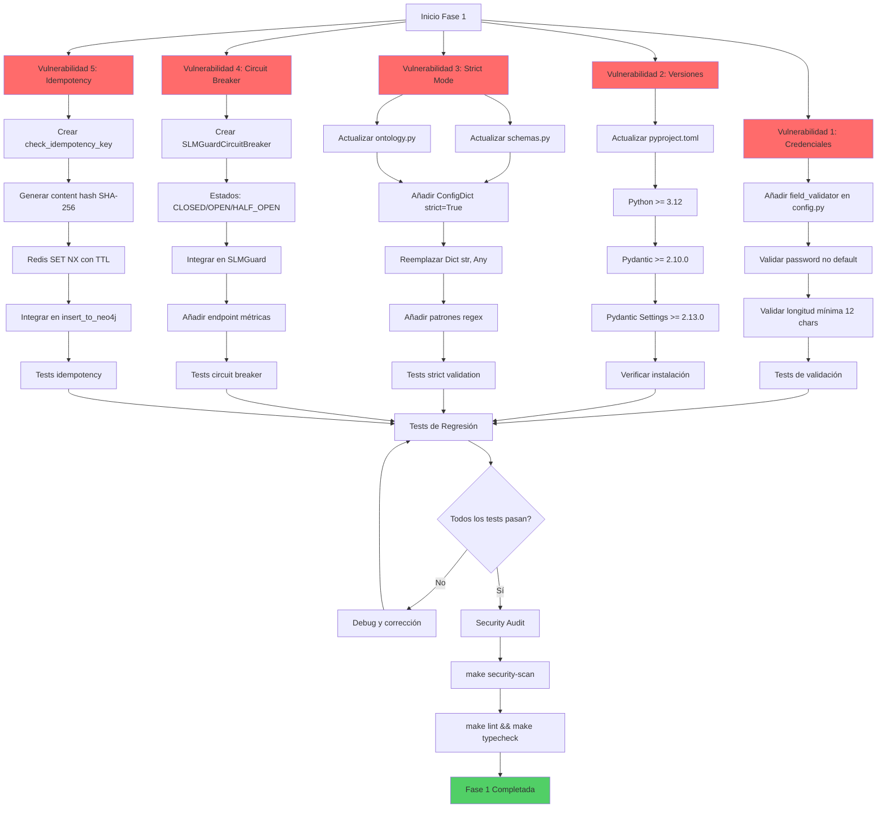

# PLAN DE CORRECCIÓN - Fase 1: Cirugía de Vulnerabilidades Críticas

**Proyecto:** Nexus Graph AI  
**Fecha:** 2026-04-04  
**Objetivo:** Estabilizar los cimientos del sistema corrigiendo 5 vulnerabilidades CRÍTICAS antes de implementar GraphRAG completo  
**Restricción:** NO tocar componentes ausentes (Vector Embeddings, Traversal)

---

## 📋 RESUMEN EJECUTIVO

Este plan aborda las 5 vulnerabilidades críticas identificadas en [`CURRENT_STATE.md`](../CURRENT_STATE.md) Sección B, aplicando estándares B2B 2026:

1. ✅ **Tipado Pydantic Incompleto** - Validación de credenciales por defecto
2. ✅ **Versión de Pydantic** - Inconsistencia en pyproject.toml
3. ✅ **Strict Mode Ausente** - Modelos sin validación estricta
4. ✅ **SLM Guard Fail-Closed** - Circuit Breaker para degradación gradual
5. ✅ **Idempotency Keys** - Prevención de duplicados en ingesta

---

## 🎯 VULNERABILIDAD #1: Validación de Credenciales por Defecto

### Problema Identificado

**Archivo:** [`core/config.py`](../core/config.py:99)  
**Línea:** 99

```python
NEO4J_PASSWORD: SecretStr = secrets.get_secret_str("NEO4J_PASSWORD", "password")
```

**Impacto:** Riesgo de despliegue en producción con credenciales hardcodeadas por defecto.

### Solución B2B 2026

Añadir validador de campo que rechace credenciales por defecto en producción.

### Pasos de Implementación

- [ ] **Paso 1.1:** Abrir [`core/config.py`](../core/config.py:84)
- [ ] **Paso 1.2:** Localizar la clase `Settings` (línea 84)
- [ ] **Paso 1.3:** Añadir validador de campo después del validador de `REDIS_URL` (línea ~135)
- [ ] **Paso 1.4:** Implementar el siguiente código:

```python
@field_validator("NEO4J_PASSWORD")
@classmethod
def validate_password_not_default(cls, v: SecretStr) -> SecretStr:
    """
    Previene despliegues en producción con credenciales por defecto.
    Estándar B2B 2026: Fail-fast en configuración insegura.
    """
    if v.get_secret_value() in ["password", "neo4j", "admin", "123456"]:
        raise ValueError(
            "Production deployment with default password is forbidden. "
            "Set NEO4J_PASSWORD environment variable with a secure credential."
        )
    
    # Validar longitud mínima (12 caracteres para SOC2)
    if len(v.get_secret_value()) < 12:
        raise ValueError(
            "NEO4J_PASSWORD must be at least 12 characters for SOC2 compliance."
        )
    
    return v
```

- [ ] **Paso 1.5:** Verificar que el import de `SecretStr` está presente (línea 5)
- [ ] **Paso 1.6:** Ejecutar tests de validación:

```bash
# Test que debe FALLAR con password por defecto
NEO4J_PASSWORD="password" python -c "from core.config import settings"

# Test que debe PASAR con password seguro
NEO4J_PASSWORD="SecureP@ssw0rd2026!" python -c "from core.config import settings; print('✓ Validation passed')"
```

- [ ] **Paso 1.7:** Actualizar documentación en `.env.example` con ejemplo de password seguro

### Archivos Afectados

- [`core/config.py`](../core/config.py:84) - Añadir validador

### Criterios de Aceptación

- ✅ El sistema rechaza passwords en lista negra (password, neo4j, admin, 123456)
- ✅ El sistema requiere mínimo 12 caracteres
- ✅ El error es claro y accionable para el operador
- ✅ Tests unitarios pasan con passwords seguros

---

## 🎯 VULNERABILIDAD #2: Inconsistencia en Versión de Pydantic

### Problema Identificado

**Archivo:** [`pyproject.toml`](../pyproject.toml:5)  
**Líneas:** 5-7

```toml
requires-python = ">=3.10"
dependencies = [
    "pydantic-settings>=2.0.0",
]
```

**Problemas:**
1. Requiere Python 3.10+ pero el stack es Python 3.12
2. No hay pin de `pydantic>=2.10` (solo está en requirements.txt)
3. `pydantic-settings>=2.0.0` es demasiado permisivo

**Impacto:** Inconsistencias entre entornos, breaking changes no controlados.

### Solución B2B 2026

Alinear versiones con el stack real y aplicar semantic versioning estricto.

### Pasos de Implementación

- [ ] **Paso 2.1:** Abrir [`pyproject.toml`](../pyproject.toml:1)
- [ ] **Paso 2.2:** Actualizar `requires-python` (línea 5):

```toml
requires-python = ">=3.12"
```

- [ ] **Paso 2.3:** Reemplazar sección `dependencies` (líneas 6-8) con:

```toml
dependencies = [
    "pydantic>=2.10.0,<3.0.0",
    "pydantic-settings>=2.13.0,<3.0.0",
    "pydantic-ai>=0.0.14,<1.0.0",
]
```

- [ ] **Paso 2.4:** Actualizar `target-version` en ruff (línea 12):

```toml
target-version = "py312"
```

- [ ] **Paso 2.5:** Verificar consistencia con [`requirements.txt`](../requirements.txt):

```bash
# Verificar que las versiones en requirements.txt sean compatibles
grep "pydantic" requirements.txt
```

- [ ] **Paso 2.6:** Ejecutar validación de dependencias:

```bash
# Reinstalar con versiones actualizadas
pip install -e .

# Verificar versiones instaladas
python -c "import pydantic; print(f'Pydantic: {pydantic.__version__}')"
python -c "import pydantic_settings; print(f'Pydantic Settings: {pydantic_settings.__version__}')"
```

- [ ] **Paso 2.7:** Actualizar Dockerfile si especifica versión de Python:

```dockerfile
FROM python:3.12-slim
```

### Archivos Afectados

- [`pyproject.toml`](../pyproject.toml:1) - Actualizar versiones
- [`Dockerfile`](../Dockerfile:1) - Verificar versión de Python base

### Criterios de Aceptación

- ✅ `requires-python = ">=3.12"`
- ✅ Pydantic pinned a `>=2.10.0,<3.0.0`
- ✅ Pydantic Settings pinned a `>=2.13.0,<3.0.0`
- ✅ Ruff target es `py312`
- ✅ Todas las dependencias se instalan sin conflictos

---

## 🎯 VULNERABILIDAD #3: Ausencia de Strict Mode en Pydantic Models

### Problema Identificado

**Archivos:** 
- [`core/schemas.py`](../core/schemas.py:6) - Clase `Node`
- [`core/ontology.py`](../core/ontology.py:14) - Clases `EntitySchema`, `RelationshipSchema`

**Problema:**
```python
class Node(BaseModel):
    id: str
    label: AllowedNodeLabels
    properties: Dict[str, Any]  # ❌ Any permite cualquier tipo
```

**Impacto:** 
- Coerción implícita de tipos (ej: `"123"` → `123`)
- Campos extra no validados
- Violación del principio fail-fast

### Solución B2B 2026

Aplicar `strict=True` y `extra="forbid"` en todos los modelos, con tipado explícito.

### Pasos de Implementación

#### 3.A - Actualizar `core/schemas.py`

- [ ] **Paso 3.1:** Abrir [`core/schemas.py`](../core/schemas.py:1)
- [ ] **Paso 3.2:** Añadir imports necesarios (después de línea 2):

```python
from pydantic import BaseModel, Field, ConfigDict
from typing import List, Dict, Union
```

- [ ] **Paso 3.3:** Actualizar clase `Node` (línea 6):

```python
class Node(BaseModel):
    """
    Nodo del grafo con validación estricta B2B 2026.
    - strict=True: Sin coerción de tipos
    - extra="forbid": Rechaza campos no declarados
    """
    model_config = ConfigDict(strict=True, extra="forbid")
    
    id: str = Field(
        ...,
        min_length=1,
        max_length=255,
        pattern=r"^[a-z0-9_]+$",
        description="ID único, normalizado en snake_case y minúsculas (ej. 'empresa_techcorp'). Crucial para enlaces.",
    )
    label: AllowedNodeLabels = Field(
        ...,
        description="Categoría semántica obligatoria del nodo, validada contra el Enum AllowedNodeLabels.",
    )
    properties: Dict[str, Union[str, int, float, bool, None]] = Field(
        default_factory=dict,
        description="Diccionario clave-valor con los metadatos literales extraídos. Tipos explícitos: str, int, float, bool, None.",
    )
```

- [ ] **Paso 3.4:** Actualizar clase `Relationship` (línea 21):

```python
class Relationship(BaseModel):
    """
    Relación entre nodos con validación estricta B2B 2026.
    """
    model_config = ConfigDict(strict=True, extra="forbid")
    
    source_id: str = Field(
        ...,
        min_length=1,
        pattern=r"^[a-z0-9_]+$",
        description="ID exacto del nodo de origen (debe coincidir con un ID de nodo extraído).",
    )
    target_id: str = Field(
        ...,
        min_length=1,
        pattern=r"^[a-z0-9_]+$",
        description="ID exacto del nodo de destino (debe coincidir con un ID de nodo extraído).",
    )
    type: str = Field(
        ...,
        min_length=1,
        pattern=r"^[A-Z][A-Z0-9_]*$",
        description="Tipo de relación en UPPERCASE_SNAKE_CASE (ej. 'FIRMO_CONTRATO', 'CONTIENE_RIESGO').",
    )
    properties: Dict[str, Union[str, int, float, bool, None]] = Field(
        default_factory=dict,
        description="Metadatos de la relación (ej. 'fecha')."
    )
```

- [ ] **Paso 3.5:** Actualizar clase `GraphExtraction` (línea 39):

```python
class GraphExtraction(BaseModel):
    """
    Resultado de extracción de grafo con validación estricta.
    """
    model_config = ConfigDict(strict=True, extra="forbid")
    
    nodes: List[Node] = Field(
        ...,
        min_length=0,
        description="Lista de todos los nodos detectados."
    )
    relationships: List[Relationship] = Field(
        ...,
        min_length=0,
        description="Lista de relaciones lógicas que conectan los nodos."
    )
```

#### 3.B - Actualizar `core/ontology.py`

- [ ] **Paso 3.6:** Abrir [`core/ontology.py`](../core/ontology.py:1)
- [ ] **Paso 3.7:** Añadir import de `ConfigDict` (línea 2):

```python
from pydantic import BaseModel, Field, create_model, ConfigDict
```

- [ ] **Paso 3.8:** Actualizar clase `EntitySchema` (línea 14):

```python
class EntitySchema(BaseModel):
    """
    Esquema de entidad con validación estricta B2B 2026.
    """
    model_config = ConfigDict(strict=True, extra="forbid")
    
    name: str = Field(..., min_length=1, max_length=100)
    aliases: List[str] = Field(default_factory=list)
    description: str = Field(default="", max_length=1000)
    properties: Dict[str, Type] = Field(default_factory=dict)
    valid_from: datetime = Field(default_factory=datetime.utcnow)
    valid_until: Optional[datetime] = Field(default=None)
    confidence_score: float = Field(default=1.0, ge=0.0, le=1.0)
```

- [ ] **Paso 3.9:** Actualizar clase `RelationshipSchema` (línea 24):

```python
class RelationshipSchema(BaseModel):
    """
    Esquema de relación con validación estricta B2B 2026.
    """
    model_config = ConfigDict(strict=True, extra="forbid")
    
    name: str = Field(..., min_length=1, max_length=100)
    aliases: List[str] = Field(default_factory=list)
    description: str = Field(default="", max_length=1000)
    allowed_sources: List[str] = Field(default_factory=list)
    allowed_targets: List[str] = Field(default_factory=list)
    valid_from: datetime = Field(default_factory=datetime.utcnow)
    valid_until: Optional[datetime] = Field(default=None)
    confidence_score: float = Field(default=1.0, ge=0.0, le=1.0)
```

#### 3.C - Testing y Validación

- [ ] **Paso 3.10:** Crear test de validación estricta en `tests/test_strict_validation.py`
- [ ] **Paso 3.11:** Ejecutar tests: `pytest tests/test_strict_validation.py -v`
- [ ] **Paso 3.12:** Ejecutar tests de regresión: `pytest tests/ -v --tb=short`

### Archivos Afectados

- [`core/schemas.py`](../core/schemas.py:1) - Añadir strict mode a 3 clases
- [`core/ontology.py`](../core/ontology.py:14) - Añadir strict mode a 2 clases
- `tests/test_strict_validation.py` - Nuevo archivo de tests

### Criterios de Aceptación

- ✅ Todos los modelos tienen `model_config = ConfigDict(strict=True, extra="forbid")`
- ✅ `Dict[str, Any]` reemplazado por `Dict[str, Union[str, int, float, bool, None]]`
- ✅ Patrones regex añadidos para IDs y tipos de relación
- ✅ Tests de validación estricta pasan
- ✅ Tests de regresión pasan sin errores

---

## 🎯 VULNERABILIDAD #4: SLM Guard con Fail-Closed Demasiado Agresivo

### Problema Identificado

**Archivo:** [`core/security_guardrails.py`](../core/security_guardrails.py:117)  
**Líneas:** 117-120

```python
except Exception as e:
    logger.error(f"SLM Guard Infrastructure failure: {e}", exc_info=True)
    return False  # ❌ FAIL-CLOSED bloquea TODO en caso de fallo
```

**Impacto:** Un fallo de red/timeout del SLM Guard bloquea TODAS las operaciones del sistema.

### Solución B2B 2026

Implementar Circuit Breaker para degradación gradual:
- Después de N fallos consecutivos → modo "warn-only"
- Métricas de disponibilidad en Prometheus
- Auto-recovery cuando el servicio se recupera

### Pasos de Implementación

- [ ] **Paso 4.1:** Abrir [`core/security_guardrails.py`](../core/security_guardrails.py:1)
- [ ] **Paso 4.2:** Crear clase `SLMGuardCircuitBreaker` antes de la clase `SLMGuard` (~línea 63)
- [ ] **Paso 4.3:** Implementar estados: CLOSED, OPEN, HALF_OPEN
- [ ] **Paso 4.4:** Actualizar clase `SLMGuard` para usar el Circuit Breaker
- [ ] **Paso 4.5:** Añadir endpoint de métricas en [`api/main.py`](../api/main.py)
- [ ] **Paso 4.6:** Crear tests del Circuit Breaker en `tests/test_circuit_breaker.py`
- [ ] **Paso 4.7:** Ejecutar tests: `pytest tests/test_circuit_breaker.py -v`

### Archivos Afectados

- [`core/security_guardrails.py`](../core/security_guardrails.py:63) - Añadir Circuit Breaker
- [`api/main.py`](../api/main.py:1) - Añadir endpoint de métricas
- `tests/test_circuit_breaker.py` - Nuevo archivo de tests

### Criterios de Aceptación

- ✅ Circuit Breaker implementado con 3 estados (CLOSED, OPEN, HALF_OPEN)
- ✅ Threshold configurable (default: 5 fallos)
- ✅ Recovery timeout configurable (default: 60s)
- ✅ Modo warn-only activo cuando circuit breaker está OPEN
- ✅ Endpoint `/metrics/slm-guard` expone estado del circuit breaker
- ✅ Tests de circuit breaker pasan
- ✅ Logs claros sobre transiciones de estado

---

## 🎯 VULNERABILIDAD #5: Falta de Idempotency Keys en Ingestion

### Problema Identificado

**Archivo:** [`core/worker.py`](../core/worker.py:42)  
**Líneas:** 42-56

```python
async def insert_to_neo4j(graph_data: GraphExtraction) -> None:
    async with lock_manager.acquire_node_lock("global_ingest") as fencing_token:
        await neo4j_repo.add_graph_data(graph_data, fencing_token)
```

**Problema:** 
- No hay verificación de idempotencia
- Kafka redelivery puede causar duplicados
- [`multi_agent.py`](../core/multi_agent.py:77) SÍ usa `check_idempotency_key()` pero el worker NO

**Impacto:** Duplicación de datos en caso de redelivery de Kafka.

### Solución B2B 2026

Implementar idempotency keys basadas en hash del contenido antes de inserción.

### Pasos de Implementación

- [ ] **Paso 5.1:** Abrir [`core/worker.py`](../core/worker.py:1)
- [ ] **Paso 5.2:** Añadir función `check_idempotency_key` antes de `insert_to_neo4j` (~línea 42)
- [ ] **Paso 5.3:** Implementar verificación usando Redis con SET NX
- [ ] **Paso 5.4:** Actualizar función `insert_to_neo4j` para generar content hash y verificar idempotencia
- [ ] **Paso 5.5:** Añadir logs cuando se detecta duplicado
- [ ] **Paso 5.6:** Crear tests de idempotencia en `tests/test_idempotency.py`
- [ ] **Paso 5.7:** Ejecutar tests: `pytest tests/test_idempotency.py -v`
- [ ] **Paso 5.8:** Verificar integración con Kafka redelivery

### Archivos Afectados

- [`core/worker.py`](../core/worker.py:42) - Añadir idempotency checks
- `tests/test_idempotency.py` - Nuevo archivo de tests

### Criterios de Aceptación

- ✅ Content hash generado con SHA-256 de JSON serializado (sort_keys=True)
- ✅ Redis usado para almacenar hashes procesados con TTL de 7 días
- ✅ Operación atómica con `SET NX` (solo set si no existe)
- ✅ Fail-open en caso de fallo de Redis (mejor duplicado que bloqueo)
- ✅ Logs claros cuando se detecta duplicado
- ✅ Tests de idempotencia pasan
- ✅ Kafka redelivery no causa duplicados en Neo4j

---

## 📊 DIAGRAMA DE FLUJO DE CORRECCIONES



---

## 🧪 PLAN DE TESTING INTEGRAL

### Tests Unitarios por Vulnerabilidad

```bash
# Vulnerabilidad 1: Credenciales
pytest tests/test_config.py::test_password_validation -v

# Vulnerabilidad 2: Versiones (verificación manual)
python -c "import pydantic; assert pydantic.__version__ >= '2.10.0'"

# Vulnerabilidad 3: Strict Mode
pytest tests/test_strict_validation.py -v

# Vulnerabilidad 4: Circuit Breaker
pytest tests/test_circuit_breaker.py -v

# Vulnerabilidad 5: Idempotency
pytest tests/test_idempotency.py -v
```

### Tests de Regresión

```bash
# Ejecutar suite completa
pytest tests/ -v --tb=short --cov=core --cov-report=html

# Verificar cobertura mínima 80%
pytest tests/ --cov=core --cov-fail-under=80
```

### Security Audit

```bash
# Bandit security scan
make security-scan

# Ruff linting
make lint

# MyPy type checking
make typecheck
```

---

## 📝 CHECKLIST DE VALIDACIÓN FINAL

### Pre-Deployment Checklist

- [ ] **Código**
  - [ ] Todas las vulnerabilidades corregidas
  - [ ] Tests unitarios pasan (100%)
  - [ ] Tests de regresión pasan (100%)
  - [ ] Cobertura de código >= 80%
  - [ ] Sin warnings de MyPy
  - [ ] Sin issues de Bandit (severity HIGH/MEDIUM)

- [ ] **Configuración**
  - [ ] `pyproject.toml` actualizado con versiones correctas
  - [ ] `.env.example` actualizado con ejemplos seguros
  - [ ] Documentación de configuración actualizada

- [ ] **Seguridad**
  - [ ] Validación de credenciales activa
  - [ ] Circuit Breaker configurado correctamente
  - [ ] Idempotency keys funcionando
  - [ ] Strict mode en todos los modelos Pydantic

- [ ] **Observabilidad**
  - [ ] Logs estructurados para todas las correcciones
  - [ ] Métricas de circuit breaker expuestas
  - [ ] Métricas de duplicados detectados

---

## 🚀 ORDEN DE EJECUCIÓN RECOMENDADO

### Día 1: Fundamentos (Vulnerabilidades 1-2)

1. **Mañana:** Vulnerabilidad #2 (Versiones)
   - Actualizar `pyproject.toml`
   - Reinstalar dependencias
   - Verificar compatibilidad

2. **Tarde:** Vulnerabilidad #1 (Credenciales)
   - Añadir validadores
   - Crear tests
   - Actualizar documentación

### Día 2: Validación Estricta (Vulnerabilidad 3)

1. **Mañana:** Actualizar `schemas.py`
   - Añadir ConfigDict
   - Actualizar tipos
   - Crear tests

2. **Tarde:** Actualizar `ontology.py`
   - Añadir ConfigDict
   - Tests de regresión completos

### Día 3: Resiliencia (Vulnerabilidades 4-5)

1. **Mañana:** Vulnerabilidad #4 (Circuit Breaker)
   - Implementar SLMGuardCircuitBreaker
   - Integrar en SLMGuard
   - Tests y métricas

2. **Tarde:** Vulnerabilidad #5 (Idempotency)
   - Implementar check_idempotency_key
   - Integrar en worker
   - Tests de Kafka redelivery

### Día 4: Validación y Deployment

1. **Mañana:** Testing integral
   - Suite completa de tests
   - Security audit
   - Verificación de cobertura

2. **Tarde:** Preparación para deployment
   - Actualizar documentación
   - Crear CHANGELOG
   - Code review final

---

## 📈 MÉTRICAS DE ÉXITO

### KPIs de Fase 1

| Métrica | Objetivo | Medición |
|---------|----------|----------|
| **Vulnerabilidades Críticas Resueltas** | 5/5 (100%) | Manual checklist |
| **Cobertura de Tests** | >= 80% | `pytest --cov` |
| **Security Score (Bandit)** | 0 HIGH/MEDIUM issues | `make security-scan` |
| **Type Safety (MyPy)** | 0 errors | `make typecheck` |
| **Circuit Breaker Uptime** | >= 99.9% | Prometheus metrics |
| **Duplicados Detectados** | > 0 en redelivery | Logs + Redis metrics |

---

## 🔄 ROLLBACK PLAN

### Si algo falla durante la implementación:

1. **Vulnerabilidad #1-2 (Config/Versiones):**
   ```bash
   git checkout HEAD~1 core/config.py pyproject.toml
   pip install -r requirements.txt
   ```

2. **Vulnerabilidad #3 (Strict Mode):**
   ```bash
   git checkout HEAD~1 core/schemas.py core/ontology.py
   pytest tests/test_ingest.py
   ```

3. **Vulnerabilidad #4 (Circuit Breaker):**
   ```bash
   git checkout HEAD~1 core/security_guardrails.py
   ```

4. **Vulnerabilidad #5 (Idempotency):**
   ```bash
   git checkout HEAD~1 core/worker.py
   ```

### Rollback Completo de Fase 1:

```bash
git revert --no-commit HEAD~4..HEAD
git commit -m "Rollback: Fase 1 - Revertir correcciones de vulnerabilidades"
git push origin main
```

---

## 📚 REFERENCIAS

### Documentos del Proyecto

- [`CURRENT_STATE.md`](../CURRENT_STATE.md) - Estado actual y vulnerabilidades
- [`00_REQUERIMENTS.MD`](../.clients/00_REQUERIMENTS.MD) - Requerimientos de Fase 1
- [`README.md`](../README.md) - Documentación general del proyecto

### Estándares B2B 2026

- **Pydantic V2:** Strict Mode Documentation
- **Circuit Breaker Pattern:** Martin Fowler - Circuit Bre